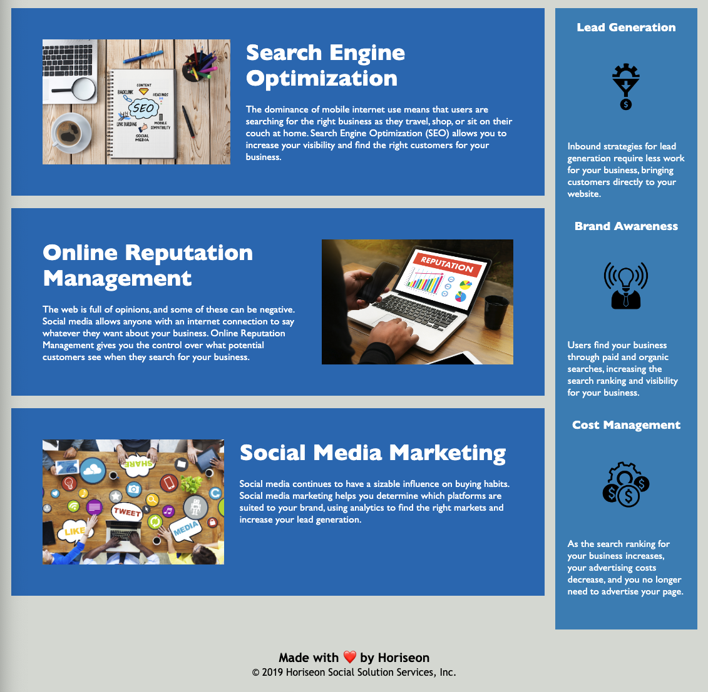

# Web Accessibility Challenge 1

## Description

This Web Accessibility Challenge 1 was created to improve the accessibility of the HTML of the webpage and to optimize it for search engines. It contains an HTML file with semantic HTML elements, as well as an improved CSS file to create a website that meets accessibility standards. 

## Installation

N/A

## Usage

To use this website, you can click any of the three nav bar elements and it will take you to the designated section. You can review any infomration regarding Horiseon by reading about Search Engine Optemization, Online Reputation Management, and Social Media Marketing. There is also additional information about Lead Generation, Brand Awareness, and Cost Management. 

[website](https://bycait27.github.io/web-accessibility-challenge-1/)

## Credits

N/A

## License

Please refer to the LICENSE in the repo. 